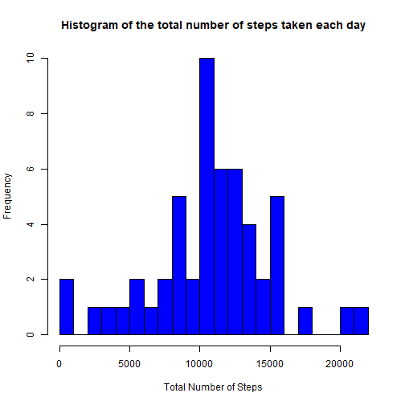
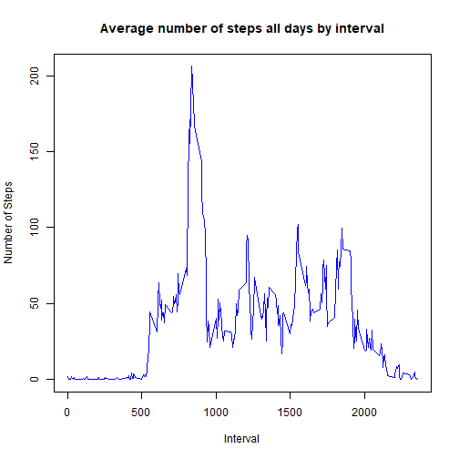
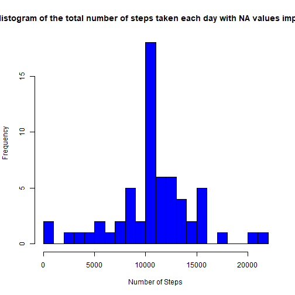
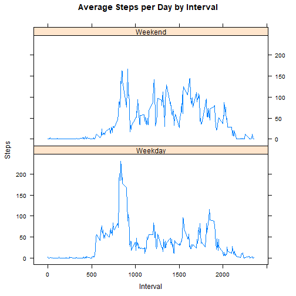

Github repo for the Course: [Reproducible Research](https://github.com/ChristinaY123/Coursera_Course5_Project1)
</br>


## 1. Introduction
This project is to interpret the data from a personal activity monitoring device using statistical methods. The data consists of two months of data from an anonymous individual collected during the months of October and November, 2012 and includes the number of steps taken in 5 minute intervals each day.

Information on the Data and Processing Requirements: [Project Description](https://www.coursera.org/learn/reproducible-research/peer/gYyPt/course-project-1)

## 2. Data Processing
### 2.1 Read data

Download the zipped raw data file, extract the data and read the .csv into a dataframe.

```r
data <- read.csv(file = 'repdata_data_activity/activity.csv')
```

### 2.2: Total number of steps taken each day
Calculate totaly number of steps taken each day and the corresponding mean and median values.

```r
# calculate totaly number of steps taken each day
totalSteps_per_day <- aggregate(steps ~ date, data, sum)
# histogram of the total number of steps taken each day
hist(as.numeric(totalSteps_per_day$steps), breaks = 20, col = "blue",
     xlab = "Total Number of Steps", main = "Histogram of the total number of steps taken each day")
```



```r
# mean and median of total numbers of steps taken each day
mean_totSteps <- mean(totalSteps_per_day$steps)
mean_totSteps
```

```
## [1] 10766.19
```

```r
median_totSteps <- median(totalSteps_per_day$steps)
median_totSteps
```

```
## [1] 10765
```

### 2.3: Average number of steps taken per interval
Calculate the average number of steps taken per interval and find the interval with maximum average number of steps 

```r
# calculate the average number of steps taken per interval
avgSteps_per_interval <- aggregate(steps ~ interval, data, mean)
# time series plot of the average number of steps taken per interval
plot(as.integer(avgSteps_per_interval$interval), avgSteps_per_interval$steps, type = "l", 
       xlab = "Interval", ylab="Number of Steps", main="Average number of steps all days by interval", col = "blue")
```



```r
# find the 5-minute interval that, on average, contains the maximum number of steps
max_steps <- max(avgSteps_per_interval$steps)
max_steps
```

```
## [1] 206.1698
```

```r
interval_max_steps <- avgSteps_per_interval[which.max(avgSteps_per_interval$steps),]$interval
interval_max_steps
```

```
## [1] 835
```
The 5-minute interval that contains the maximum number of steps ( 206.2 steps ) is the interval 835.

### 2.4: Manipulation of missing data
Detect the missing data and replace the NA with the mean steps of 5-minute interval. Plot histogram of the total number of steps taken each day after missing values are imputed. 

```r
# check if there is missing data for each variable
totalStepNA <- sum(is.na(as.character(data$steps)))
totalStepNA
```

```
## [1] 2304
```

```r
totalDateNA <- sum(is.na(as.character(data$date)))
totalDateNA
```

```
## [1] 0
```

```r
totalIntervalNA <- sum(is.na(as.character(data$interval)))
totalIntervalNA
```

```
## [1] 0
```

```r
# find the indices of missing data with value of NA  
NA_index <- which(is.na(as.character(data$steps)))
complete_data <- data
# missing step valve is replaced by the mean steps of that 5-minute interval 
complete_data[NA_index, ]$steps <- unlist(lapply(NA_index, FUN = function(NA_index) {
       avgSteps_per_interval[data[NA_index,]$interval == avgSteps_per_interval$interval,]$steps
}))
# histogram of the total number of steps taken each day after missing values are imputed
totalSteps_per_day_complete <- aggregate(steps ~ date, data = complete_data, sum)
hist(as.numeric(totalSteps_per_day_complete$steps), breaks = 20, col = "blue", 
       xlab = "Number of Steps", main = "Histogram of the total number of steps taken each day with NA values imputed")
```



```r
# mean and median of the total number of steps taken each day after missing values are imputed
mean_totalSteps_per_day_complete <- mean(totalSteps_per_day_complete$steps)
mean_totalSteps_per_day_complete
```

```
## [1] 10766.19
```

```r
median_totalSteps_per_day_complete <- median(totalSteps_per_day_complete$steps)
median_totalSteps_per_day_complete
```

```
## [1] 10766.19
```
As can be observed, the total number of missing values in the dataset is 2304.The mean of the original dateset is 10766.19, equal to the mean of the complete dataset with missing values imputed. The median of the total number of steps each day has shifted from 10765 for the original dateset to 10766 for the complete dataset. The impact of imputing missing data on the estimates of the total daily number of steps is insignificant in this data analysis project. 

### 2.5: Differentiate the average number of steps per interval by weekdays and weekends
Compare the average number of steps taken per 5-minute interval between weekdays and weekends using panel plot.

```r
# panel plot comparing the average number of steps taken per 5-minute interval across weekdays and weekends
weekdays <- c("Monday", "Tuesday", "Wednesday", "Thursday", "Friday")
complete_data$dow <- as.factor(ifelse(is.element(weekdays(as.Date(complete_data$date)), weekdays), "Weekday", "Weekend"))
avgSteps_per_interval_dow <- aggregate(steps ~ interval + dow, complete_data, mean)
library(lattice)
xyplot(avgSteps_per_interval_dow$steps ~ avgSteps_per_interval_dow$interval|avgSteps_per_interval_dow$dow, 
       main = "Average Steps per Day by Interval", xlab = "Interval", ylab = "Steps",layout = c(1,2), type = "l")
```


